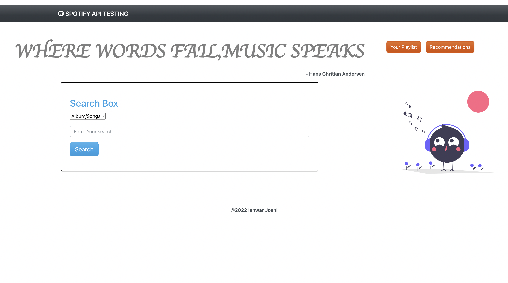
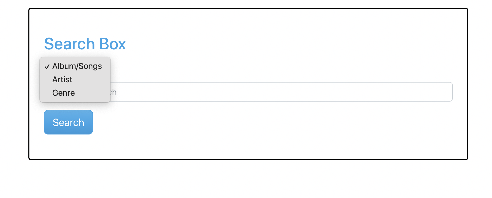

#Spotify API Testing

##Installation Steps

step 1 : `Clone This repository on your Machine`
step 2 : `Run 'npm install' from backend,frontend,root`
step 3 : `Run 'npm run dev' from root`


##Implementation details

###Login
Login is must as token must be generated from spotify and it is saved in Session storage


###Search:
Search feature is developed for Albums,songs,artists,genre 
Call goes to the backend server with specified params , backend server calls spotify API by providing token in the header.Spotify returns data to the backend which is then returned to the frontend. 

[Spotify API for search](https://developer.spotify.com/documentation/web-api/reference/#/operations/search)



###Albums , Artists , Genre
User can search his favorite Tracks using any of the above methods.



[Spotify API for Album tracks](https://developer.spotify.com/documentation/web-api/reference/#/operations/get-an-albums-tracks)
[Spotify API from Artist Tracks](https://developer.spotify.com/documentation/web-api/reference/#/operations/get-an-artists-top-tracks)

###Playlist
For the demonastration purpose playlist is stored in localstorage. Playlist has the option to edit playlist name, add musics to the playlist and remove musics from the playlist. Playlist page also shows Last Modified Tag.


###Recommendation
Based on the recent activity of the user , Seed_artists,seed_tracks are noted and based on the data Artists and Albums are recommended to the user. 
[Spotify API for Recommendation](https://developer.spotify.com/console/get-recommendations/)


``On clicking songs/tracks new tab will be opened with spotify play option from spotify official site``


### Directory Structure
```
.
├── Images
│   ├── login.png
│   ├── playlist.png
│   ├── recommendation.png
│   ├── search.png
│   └── types.png
├── Procfile
├── README.md
├── backend
│   ├── index.js
│   ├── node_modules
│   ├── package-lock.json
│   └── package.json
├── frontend
│   ├── README.md
│   ├── node_modules
│   ├── package-lock.json
│   ├── package.json
│   ├── public
│   └── src
├── node_modules
│   ├── ansi-regex
│   ├── ansi-styles
│   ├── chalk
│   ├── cliui
│   ├── color-convert
│   ├── color-name
│   ├── concurrently
│   ├── date-fns
│   ├── emoji-regex
│   ├── escalade
│   ├── get-caller-file
│   ├── has-flag
│   ├── is-fullwidth-code-point
│   ├── lodash
│   ├── require-directory
│   ├── rxjs
│   ├── shell-quote
│   ├── spawn-command
│   ├── string-width
│   ├── strip-ansi
│   ├── supports-color
│   ├── tree-kill
│   ├── tslib
│   ├── wrap-ansi
│   ├── y18n
│   ├── yargs
│   └── yargs-parser
├── package-lock.json
└── package.json
```
####Advancements 
` There are many things to handle while creating this application, For some APIs spotify user's Credentials are needed. And API calls return different data from different end points. This makes frontend implementation little hard.`

####Heroku Deploy
I Tried to deploy it on Heroku, But heroku is not allowing sending Authorization header for some routes in free tier deployment.This results in crashing of application.


###Demonstration
[Spotify API Testing Video](https://drive.google.com/file/d/1eAxATY6G5WTPDvyXukUUVG4AIS1q0xVL/view?usp=sharing)